# Engineering_4_Notebook

&nbsp;

## Table of Contents
* [Launch_Pad_Part_1](#Launch_Pad_Part_1)
* [Launch_Pad_Part_2](#Launch_Pad_Part_2)
* [Launch_Pad_Part_3](#Launch_Pad_Part_3)
* [Launch_Pad_Part_4](#Launch_Pad_Part_4)
* [Crash_Avoidance_Part_1](#Crash_Avoidance_Part_1)
* [Crash_Avoidance_Part_2](#Crash_Avoidance_Part_2)
* [Crash_Avoidance_Part_3](#Crash_Avoidance_Part_3)
* [Crash_Avoidance_Part_4](#Crash_Avoidance_Part_4)
* [Landing_Area_Part_1](#Landing_Area_Part_1)
* [Landing_Area_Part_2](#Landing_Area_Part_2)
* [Morse_Code_Part_1](#Morse_Code_Part_1)
* [Morse_Code_Part_2](#Morse_Code_Part_2)
* [Raspberry_Pi_Assignment_Template](#Raspberry_Pi_Assignment_Template)
* [Onshape_Assignment_Template](#onshape_assignment_template)

&nbsp;

## Launch_Pad_Part_1

### Assignment Description

Countdown from 10 seconds to 0 (liftoff). Print that countdown to the serial monitor.

### Evidence

### Code
[LaunchPadOneCode](raspberry-pi/Launch_Pad_Part_1.py)

### Reflection

To do this assignment I had to remember how to at first code again, but also how to code in circuit python instead of coding like I am coding Arduino, or java.

&nbsp;

## Launch_Pad_Part_2

### Assignment Description

Blink a red light each second of the countdown, and turn on a green LED to signify liftoff.

### Evidence

### Wiring

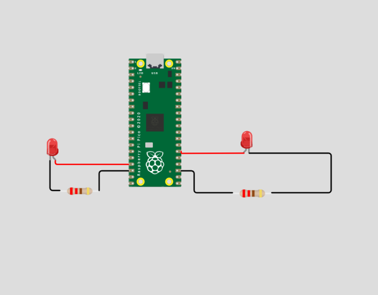

### Code
[LaunchPadTwoCode](raspberry-pi/Launch_Pad_Part_2.py)

### Reflection

This assignment was quite simple as I just combined the two assignments that I already had to do this year.

&nbsp;

## Launch_Pad_Part_3

### Assignment Description

Include a physical button that starts the countdown. 

### Evidence 

### Wiring

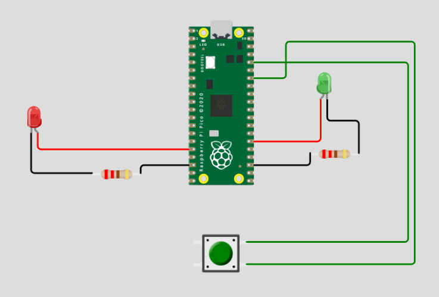

### Code

[LaunchPadThreeCode](raspberry-pi/Launch_Pad_Part_3.py)

### Reflection

In this assignment I fully realized that I should probably have a "while True:" before all of my code that runs actions. without that it will go through my code once and be done, where if I am using a if statment it wont give me the chance to input the value that I want, like pressing a button, before it ends the code.

&nbsp;

## Launch_Pad_Part_4

### Assignment Description

Actuate a 180 degree servo on liftoff to simulate the launch tower disconnecting.

### Evidence

### Wiring

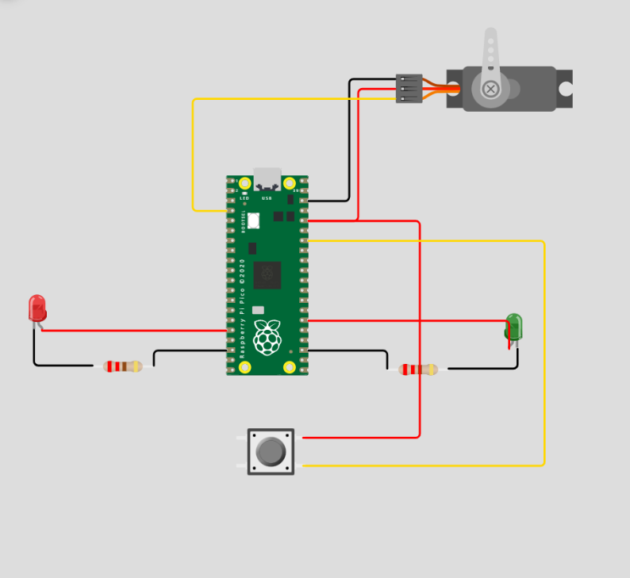

### Code
[LaunchPadFourCode](raspberry-pi/Launch_Pad_Part_4.py)

### Reflection

This assignment was really just me remembering all of the setup that I need for a servo to work and then after that it was very simple.

&nbsp;

## Crash_Avoidance_Part_1

### Assignment Description

The module must have an accelerometer that continuously reports x, y, and z acceleration values on the serial monitor.

### Evidence 
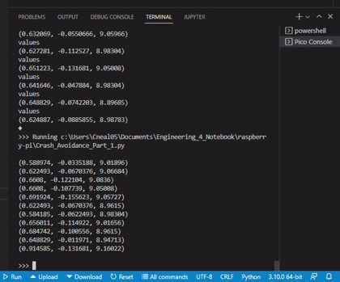

### Wiring
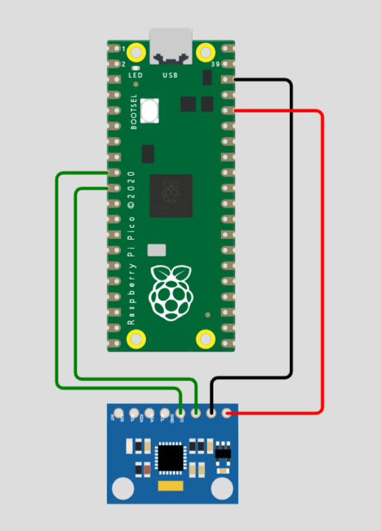

### Code
[CrashAvoidanceOneCode](raspberry-pi/Crash_Avoidance_Part_1.py)

### Reflection
Learning how to use and make the Accelerometer work was a bit of a hiccup but now after understanding how to set it up, the assignment was quite simple.

&nbsp;

## Crash_Avoidance_Part_2

### Assignment Description
The module must have an LED that turns on if the helicopter is tilted to 90 degrees. 
The module must be powered by a mobile power source.

### Evidence 

### Wiring
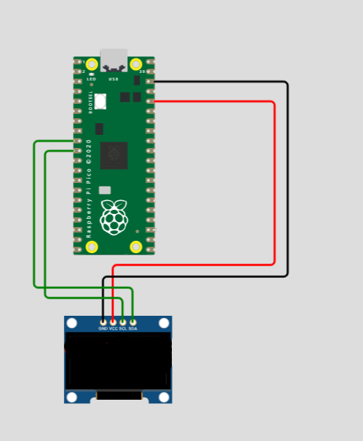

### Code
[CrashAvoidanceTwoCode](raspberry-pi/Crash_Avoidance_Part_2.py)

### Reflection
Learning how to use the PowerBoost 500C was actually pretty simple to understand, and the Tilt sensor part of this assignment was just using a if statement on the assignment before making it pretty simple to complete.

&nbsp;

## Crash_Avoidance_Part_3

### Assignment Description
The module must have an onboard screen that prints x, y, and z angular velocity values (rad/s) rounded to 3 decimal places.

### Evidence 

### Wiring
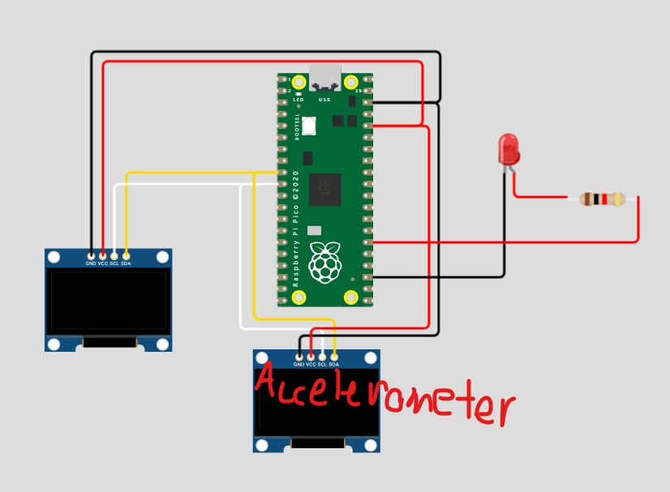

### Code
[CrashAvoidanceThreeCode](raspberry-pi/Crash_Avoidance_Part_3.py)

### Reflection
Learning how to use the OLED screen and how to use to two i2cs at once was a bit tough, but after understanding the code that is needed, it was realy quite simple.

&nbsp;

## Crash_Avoidance_Part_4

### Assignment Description
the module should NOT show a warning light if the device is more than 3 meters above its starting point.

### Evidence 

### Wiring
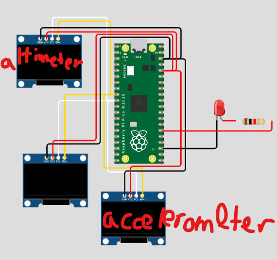

### Code
[CrashAvoidanceFourCode](raspberry-pi/Crash_Avoidance_Part_4.py)

### Reflection
Learning how to use the altimeter, something that we have not yet used yet in this class was somewhat of a difficulty.

&nbsp;

## Landing_Area_Part_1

### Assignment Description
The code must ask for the user to input a set of three coordinates in (x,y) format, the triangle's area must be determined using a function. If the user inputs coordinates incorrectly (letters or improper format) the code should return to the input stage, it should not throw an error or exit the script The triangle area must be printed to the screen in this format: “The area of the triangle with vertices (x,y), (x,y), (x,y) is {area} square km. The code must return to the input stage after printing the area, and wait for user input.

### Evidence 
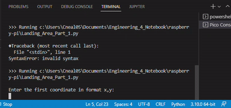

### Code
[Landing_Area_Part_1](raspberry-pi/Landing_Area_Part_1.py)

### Reflection
This assginment was the most code heavy assignment that we have done, but after understanding the floats, how to define a functions, and the try and except function this assignment was very simple.

&nbsp;

## Landing_Area_Part_2

### Assignment Description
Landing Area Part 1 with the added onboard OLED screen must plot each triangle on a graph relative to the base location.

### Evidence 

### Wiring

### Code
[Landing_Area_Part_2](raspberry-pi/Landing_Area_Part_2.py)

### Reflection
Understanding the math behind using the OLED screens and the function to graph the triangles or lines for the x and y lines.

&nbsp;

## Morse_Code_Part_1

### Assignment Description
Your script must accept text input by the user If the user types “-q”, your script must exit If the user types anything else, your script must translate the text to morse code dots and dashes, and print those to the monitor. The printed text must use a space to show breaks between letters, and a slash to show breaks between words

### Evidence 
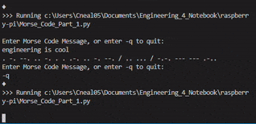

### Code
[Morse_Code_Part_1](raspberry-pi/Morse_Code_Part_1.py)

### Reflection
After figuring out how dictionaries work and how to call specific words in the dictionary, the assignment was a simple coding assignment.

&nbsp;

## Morse_Code_Part_2

### Assignment Description
Morse Code Part 1 as well as the script must flash an LED to transmit the morse code message using the timing sequence shown below

### Evidence 

### Wiring
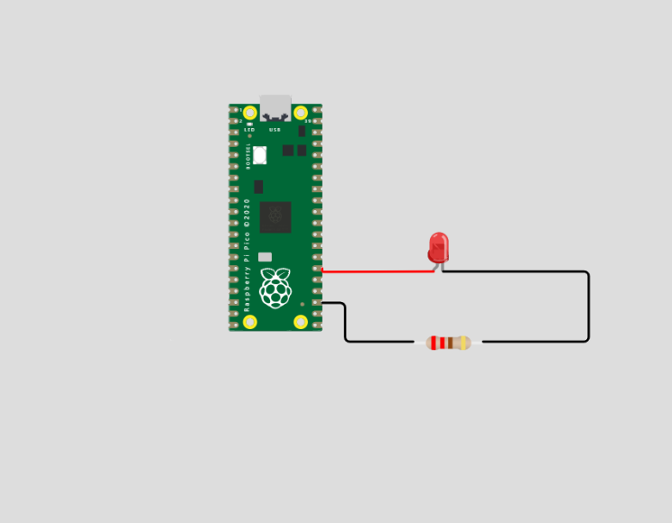

### Code
[Morse_Code_Part_2](raspberry-pi/Morse_Code_Part_2.py)

### Reflection
During this assignment I chose to use a yellow LED because those LEDS arnt usually used. I began having trouble with the assignment, but I wa spretty sure that the code was correct but when it got to a dash, the LED would do another dot as well. After a lot and a lot of trial and error, Mr.Miller and I figured outthat the yellow led was the problem all along, the yellow LEDS we had bought were blinky LEDs and when they had power would constantly blink no matter if you gave them any code. After finding another LED it worked.

&nbsp;

## Raspberry_Pi_Assignment_Template

### Assignment Description

### Evidence 

### Wiring

### Code
[Name](raspberry-pi/CodeName.py)

### Reflection

&nbsp;

## Onshape_Assignment_Template

### Assignment Description

Write your assignment description here. What is the purpose of this assignment? It should be at least a few sentences.

### Part Link 

[Create a link to your Onshape document](https://cvilleschools.onshape.com/documents/003e413cee57f7ccccaa15c2/w/ea71050bb283bf3bf088c96c/e/c85ae532263d3b551e1795d0?renderMode=0&uiState=62d9b9d7883c4f335ec42021). Don't forget to turn on link sharing in your Onshape document so that others can see it. 

### Part Image

Take a nice screenshot of your Onshape document. 

### Reflection

What went wrong / was challenging, how'd you figure it out, and what did you learn from that experience? Your goal for the reflection is to pass on knowledge that will make this assignment better or easier for the next person. Think about your audience for this one, which may be "future you" (when you realize you need some of this code in three months), me, or your college admission committee!

&nbsp;

## Media Test

Your readme will have various images and gifs on it. Upload a test image and test gif to make sure you've got the process figured out. Pick whatever image and gif you want!

### Test Link
[Hyperlink text](raspberry-pi/test.py)

### Test Image

### Test GIF

