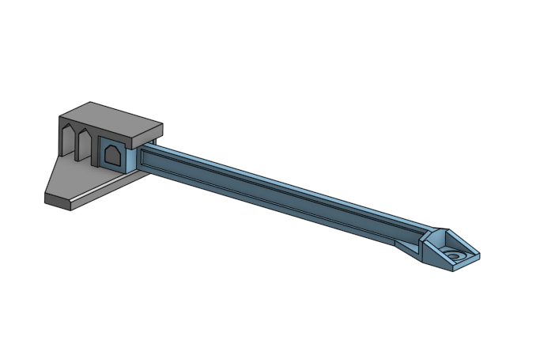
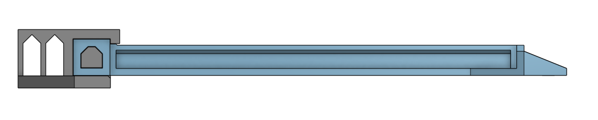

# Engineering_4_Notebook

&nbsp;

## Table of Contents
* [Launch_Pad_Part_1](#Launch_Pad_Part_1)
* [Launch_Pad_Part_2](#Launch_Pad_Part_2)
* [Launch_Pad_Part_3](#Launch_Pad_Part_3)
* [Launch_Pad_Part_4](#Launch_Pad_Part_4)
* [Crash_Avoidance_Part_1](#Crash_Avoidance_Part_1)
* [Crash_Avoidance_Part_2](#Crash_Avoidance_Part_2)
* [Crash_Avoidance_Part_3](#Crash_Avoidance_Part_3)
* [Crash_Avoidance_Part_4](#Crash_Avoidance_Part_4)
* [Landing_Area_Part_1](#Landing_Area_Part_1)
* [Landing_Area_Part_2](#Landing_Area_Part_2)
* [Morse_Code_Part_1](#Morse_Code_Part_1)
* [Morse_Code_Part_2](#Morse_Code_Part_2)
* [FEA_Part_1](#FEA_Part_1)
* [FEA_Part_2](#FEA_Part_2)
* [FEA_Part_3](#FEA_Part_3)
* [Raspberry_Pi_Assignment_Template](#Raspberry_Pi_Assignment_Template)
* [Onshape_Assignment_Template](#onshape_assignment_template)

&nbsp;

## Launch_Pad_Part_1

### Assignment Description

Countdown from 10 seconds to 0 (liftoff). Print that countdown to the serial monitor.

### Evidence

### Code
[LaunchPadOneCode](raspberry-pi/Launch_Pad_Part_1.py)

### Reflection

To do this assignment I had to first remember how to code again, but also how to code in circuit python instead of coding like I am coding Arduino, or java. Remembering how to code was the easy part, because the process had already been put in my mind but I just needed to remember. The part that was difficult for me was remembering circuit python code, because last year after we stopped with the circuit python assignments I did not do any code after that point, allowing me to forget it for an entire year. Where in Computer science we were learning java and that was what was freshest in my mind.

&nbsp;

## Launch_Pad_Part_2

### Assignment Description

Blink a red light each second of the countdown, and turn on a green LED to signify liftoff. 

### Evidence

### Wiring

### Code
[LaunchPadTwoCode](raspberry-pi/Launch_Pad_Part_2.py)

### Reflection

This assignment was quite simple as I just combined the two assignments that I already had to do this year. I had to have both leds defined seperatly at the top of my code. With those two leds one would continuously blink for each second while one would blink at the very end when that 10 second timer ran out.

&nbsp;

## Launch_Pad_Part_3

### Assignment Description

Include a physical button that starts the countdown. 

### Evidence 

### Wiring

### Code

[LaunchPadThreeCode](raspberry-pi/Launch_Pad_Part_3.py)

### Reflection

In this assignment I fully realized that I should probably have a "while True:" before all of my code that runs actions. Without that it will go through my code once and be done. Where if I am using a if statment it wont give me the chance to input the value that I want, like pressing a button, before it ends the code.

&nbsp;

## Launch_Pad_Part_4

### Assignment Description

Actuate a 180 degree servo on liftoff to simulate the launch tower disconnecting.

### Evidence

### Wiring

### Code
[LaunchPadFourCode](raspberry-pi/Launch_Pad_Part_4.py)

### Reflection

This assignment was really just me remembering all of the setup that I need for a servo to work. That setup required me to remember how to define the servo with all of the right wiring of which of the three wires connected to the servo does what. After remembering how to set up a servo I had to set it up so that when the for loop of counting down the servo would turn acting like the launch tower allowing the rocket to lift off.  

&nbsp;

## Crash_Avoidance_Part_1

### Assignment Description

The module must have an accelerometer that continuously reports x, y, and z acceleration values on the serial monitor.

### Evidence 

### Wiring

### Code
[CrashAvoidanceOneCode](raspberry-pi/Crash_Avoidance_Part_1.py)

### Reflection
Learning how to use and make the Accelerometer work was a bit of a hiccup but now after understanding how to set it up, the assignment was quite simple. what I had to do to figure out the acceleremoter was understanding sda scl pins and making sure I had that defined at the beginning of my code. After setting up the sda and scl I had to set up the i2c and then printing the mpu.acceleration in a print in thr while(True):

&nbsp;

## Crash_Avoidance_Part_2

### Assignment Description
The module must have an LED that turns on if the helicopter is tilted to 90 degrees. 
The module must be powered by a mobile power source.

### Evidence 

### Wiring

### Code
[CrashAvoidanceTwoCode](raspberry-pi/Crash_Avoidance_Part_2.py)

### Reflection
Learning how to use the PowerBoost 500C was actually pretty simple to understand. The Tilt sensor part of this assignment was just using a if statement on the assignment before making it pretty simple to complete. All I had to do was set up an if statement that would check if any of the values were to go over 9.8 or -9.8 other than the last value because that one should always be 9.8 if it right side up.

&nbsp;

## Crash_Avoidance_Part_3

### Assignment Description
The module must have an onboard screen that prints x, y, and z angular velocity values (rad/s) rounded to 3 decimal places.

### Evidence 

### Wiring

### Code
[CrashAvoidanceThreeCode](raspberry-pi/Crash_Avoidance_Part_3.py)

### Reflection
Learning how to use the OLED screen and how to use to two i2cs at once was a bit tough. What I had to do was set up a certain area on my breadboard that would make it so I could hook up the accelerometer and the OLED screen at the same time. After that I had to use the i2c address test to find the i2c addresses of both the OLED and the accelerometer and then define each with their respective address.

&nbsp;

## Crash_Avoidance_Part_4

### Assignment Description
the module should NOT show a warning light if the device is more than 3 meters above its starting point.

### Evidence 

### Wiring

### Code
[CrashAvoidanceFourCode](raspberry-pi/Crash_Avoidance_Part_4.py)

### Reflection
Learning how to use the altimeter, something that we have not yet used yet in this class was somewhat of a difficulty. After setting up the altimeter I had to test the altimeter by raising the Pico up to a certain height but the wire connecting the pico to the computer was not long enough so I needed a extrenal power source. After hooking up the power source I could upload the code to the pico and go and walk upstairs.

&nbsp;

## Landing_Area_Part_1

### Assignment Description
The code must ask for the user to input a set of three coordinates in (x,y) format, the triangle's area must be determined using a function. If the user inputs coordinates incorrectly (letters or improper format) the code should return to the input stage, it should not throw an error or exit the script The triangle area must be printed to the screen in this format: “The area of the triangle with vertices (x,y), (x,y), (x,y) is {area} square km. The code must return to the input stage after printing the area, and wait for user input.

### Evidence 

### Code
[Landing_Area_Part_1](raspberry-pi/Landing_Area_Part_1.py)

### Reflection
This assginment was the most code heavy assignment that we have done. The main idea for this assignment was to understand floats, how to define a functions, and the try and except function. After understanding those I remembered what I was very used to in my CS class and asking a question and taking it as an input was very easy to complete.

&nbsp;

## Landing_Area_Part_2

### Assignment Description
Landing Area Part 1 with the added onboard OLED screen must plot each triangle on a graph relative to the base location.

### Evidence 

### Wiring

### Code
[Landing_Area_Part_2](raspberry-pi/Landing_Area_Part_2.py)

### Reflection
Understanding the math behind using the OLED screens and the function to graph the triangles or lines for the x and y lines was a major part of this assignment. In this assignment I needed to define the variables a lot of times to beable to use them in the triangle function and be able to put the points into the function to calculate the area of the triangle as well.

&nbsp;

## Morse_Code_Part_1

### Assignment Description
Your script must accept text input by the user If the user types “-q”, your script must exit If the user types anything else, your script must translate the text to morse code dots and dashes, and print those to the monitor. The printed text must use a space to show breaks between letters, and a slash to show breaks between words

### Evidence 

### Code
[Morse_Code_Part_1](raspberry-pi/Morse_Code_Part_1.py)

### Reflection
How dictionaries work and how to call specific words in the dictionary was very important in this assignment. what I need to do after I understood that was to split the word into each letter and run each letter through a for loop, turning each letter into dots and dashes. Then I would have to complete the assignment by combining the dots and dashes together so that it would be turned into a single string and output all of it at once.

&nbsp;

## Morse_Code_Part_2

### Assignment Description
Morse Code Part 1 as well as the script must flash an LED to transmit the morse code message using the timing sequence shown below

### Evidence 

### Wiring

### Code
[Morse_Code_Part_2](raspberry-pi/Morse_Code_Part_2.py)

### Reflection
During this assignment I chose to use a yellow LED because those LEDS arnt usually used. I began having trouble with the assignment, but I wa spretty sure that the code was correct but when it got to a dash, the LED would do another dot as well. After a lot and a lot of trial and error, Mr.Miller and I figured outthat the yellow led was the problem all along, the yellow LEDS we had bought were blinky LEDs and when they had power would constantly blink no matter if you gave them any code. After finding another LED it worked.

&nbsp;

## FEA_Part_1

### Assignment Description

You will design a 3D printed beam in Onshape with the goal of maximizing the weight the beam can hold before failure. The beam fails if either of the following two conditions are met: The beam break, or the beam bends more than 35 mm

### Part Link 

[Onshape_Link](https://cvilleschools.onshape.com/documents/c663cf5807934a673b2a2546/w/d75e1e7fb8e51e72b9a24f6a/e/3770c430d303f1af130ad922?renderMode=0&uiState=6373d96c55218e321ba885ca) 

### Part Image

### Reflection

Our first beam was pretty bad as it was too wide and not tall enough. Then after we swapped to have a vertical beam it made it look more structurally sound. By that I mean that the beam looks as if it would be able to hold more weight while also being a lot lighter. And with the finished project we landed at 12.98 grams making it legal for the assignment.

&nbsp;

## FEA_Part_2

### Assignment Description

Run one static finite element analysis on your beam to determine what areas need to be improved.

### Part Link 

[FEA_Part_2](https://cvilleschools.onshape.com/documents/c663cf5807934a673b2a2546/w/d75e1e7fb8e51e72b9a24f6a/e/3770c430d303f1af130ad922?renderMode=0&uiState=6373d96c55218e321ba885ca) 

### Part Image

### Reflection

With this first test it allowed us to see that the place that had the most amount of stress was the top part of the beam that was closest to the fulcrum. I then thought to maybe cut away some of the material there and then add a chamfer, or a filet. Neither of those ideas seemed to improve it in anyway, but I have come up with an idea of adding more material on top of that area.

&nbsp;

## FEA_Part_3

### Assignment Description

Use data from FEA simulations to improve the maximum weight the beam can hold before meeting one of the two failure conditions. 
Remember, the two failure conditions are the beam breaking, or bending >=35 mm

### Part Link 

[FEA_Part_3](https://cvilleschools.onshape.com/documents/c663cf5807934a673b2a2546/w/d75e1e7fb8e51e72b9a24f6a/e/3770c430d303f1af130ad922?renderMode=0&uiState=6373d96c55218e321ba885ca) 

### Part Image

### Reflection

Redesigning for our beam was making it so that there was just a bit more material where the simulation showed the most stress was going to be. After testing however, we cam across a problem that we had not thought of, that being side bend. When we tested our piece started to bend off to the side meaning that it went past the displacement parameter and then didn't hold as much as it probably could have if it stayed up-right. If we were to make the bottom of the beam slightly wider so that it would be less likely to bend over to one side.

&nbsp;

## Collabaration 4.3

### Assignment Description

Assemble the entire project putting what Student A and what Student B did, together.

### Part Link 

[Collabaration_Document](https://cvilleschools.onshape.com/documents/bd4a30d821e22581a9b814bb/w/3924901670c70451ae4c5c93/e/1d91be7892fa945f67fc8989?renderMode=0&uiState=6373deb6d9e80025a2fb0af2)

### Part Image

### Reflection

The assembly itself was pretty straightforward as we had to follow along with the directions we were given. At one point we were told to insert sock head screws directly into the place we wanted them which we had to unhide all mate connectors and click on each place we wanted for a screw to go to. Another thing that the directions told us was going to happen was the key might not align correctly when you were mating it into the copter, and you have to section view so that you can actually see where you are mating. But our key aligned perfectly and we had completed the assembly.

&nbsp;

## Raspberry_Pi_Assignment_Template

### Assignment Description

### Evidence 

### Wiring

### Code
[Name](raspberry-pi/CodeName.py)

### Reflection

&nbsp;

## Onshape_Assignment_Template

### Assignment Description

Write your assignment description here. What is the purpose of this assignment? It should be at least a few sentences.

### Part Link 

[Create a link to your Onshape document](https://cvilleschools.onshape.com/documents/003e413cee57f7ccccaa15c2/w/ea71050bb283bf3bf088c96c/e/c85ae532263d3b551e1795d0?renderMode=0&uiState=62d9b9d7883c4f335ec42021). Don't forget to turn on link sharing in your Onshape document so that others can see it. 

### Part Image

Take a nice screenshot of your Onshape document. 

### Reflection

What went wrong / was challenging, how'd you figure it out, and what did you learn from that experience? Your goal for the reflection is to pass on knowledge that will make this assignment better or easier for the next person. Think about your audience for this one, which may be "future you" (when you realize you need some of this code in three months), me, or your college admission committee!

&nbsp;

## Media Test

Your readme will have various images and gifs on it. Upload a test image and test gif to make sure you've got the process figured out. Pick whatever image and gif you want!

### Test Link
[Hyperlink text](raspberry-pi/test.py)

### Test Image

### Test GIF

